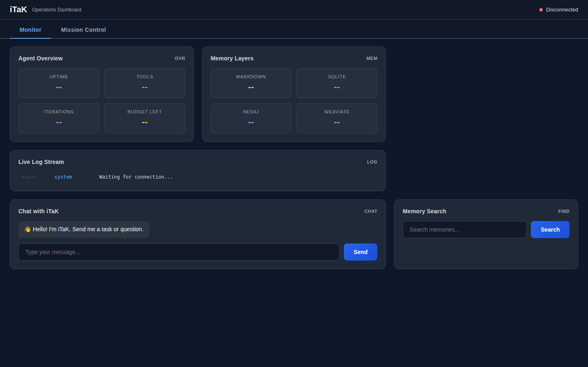
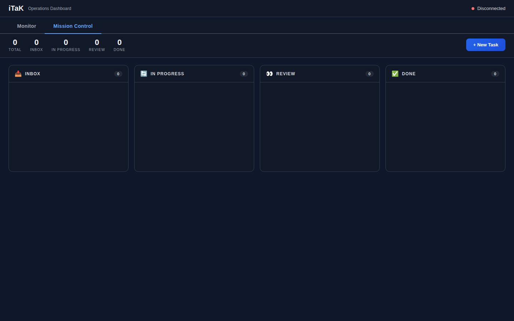
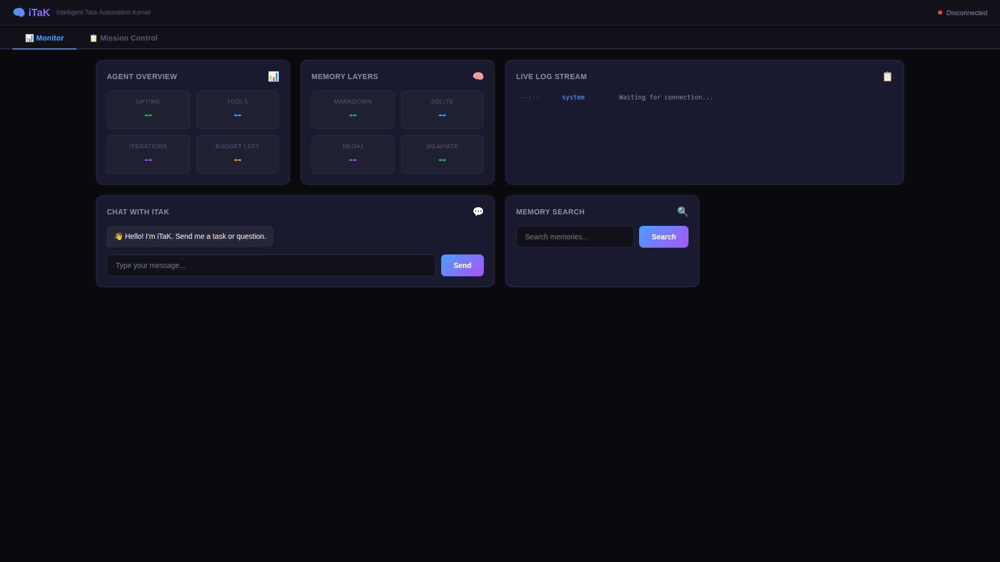
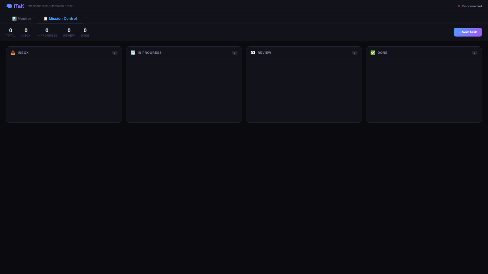

<p align="center">
  <h1 align="center">🧠 iTaK - Intelligent Task Automation Kernel</h1>
  <p align="center">
    <em>If <a href="https://github.com/frdel/agent-zero">Agent Zero</a> and <a href="https://github.com/cpacker/MemGPT">MemGPT</a> had a baby… and <a href="https://github.com/Secure-Claw/OpenClaw">OpenClaw</a> was the godfather.</em>
  </p>
  <p align="center">
    
    
    
    
    
  </p>
</p>

<p align="center">
  
  
</p>

---

## 🚀 Quick Start

### ⚡ ONE-COMMAND INSTALL (All Platforms - 2 minutes)

**One Python script works everywhere** - Linux, macOS, Windows (WSL), WSL directly

```bash
git clone https://github.com/David2024patton/iTaK.git
cd iTaK
python install.py
```

**That's it!** The installer will:

- ✅ Detect your OS automatically
- ✅ Install prerequisites (Docker, Git)
- ✅ Let you choose: Minimal or Full Stack
- ✅ Configure everything
- ✅ Start iTaK

**Then visit <http://localhost:8000> and configure via Web UI!**

### Installation Options

```bash
python install.py              # Interactive - choose minimal or full stack
python install.py --full-stack # Install with Neo4j, Weaviate, SearXNG
python install.py --minimal    # Install iTaK only (fastest)
python install.py --help       # Show all options
```

### What Gets Installed

| Option | iTaK | Neo4j | Weaviate | SearXNG | Time |
|--------|------|-------|----------|---------|------|
| **Minimal** | ✅ | ❌ | ❌ | ❌ | 2 min |
| **Full Stack** | ✅ | ✅ | ✅ | ✅ | 5 min |

📚 **[QUICK START GUIDE](QUICK_START.md)** - Complete installation walkthrough  
🆚 **Coming from Agent-Zero?** [iTAK vs Agent-Zero](docs/root/iTAK_VS_AGENT_ZERO.md)

---

**What Gets Auto-Installed:**

| Component | Minimal | Full Stack |
|-----------|---------|------------|
| iTaK Agent | ✅ | ✅ |
| Docker | Auto-detected | ✅ Auto-installed |
| Neo4j (Knowledge Graph) | ❌ | ✅ Auto-installed |
| SearXNG (Private Search) | ❌ | ✅ Auto-installed |
| Weaviate (Vector DB) | ❌ | ✅ Auto-installed |

---

**Alternative Installation Methods:**

```bash
# 🐍 Python Only (No Docker)
pip install -r install/requirements/requirements.txt
cp install/config/.env.example .env  # Add your API keys
python -m app.main --webui
```

📚 **Detailed Guide:** [INSTALLATION_GUIDE.md](docs/root/INSTALLATION_GUIDE.md)

---

**iTaK** is a modular, self-healing AI agent framework that combines Agent Zero's monologue engine with MemGPT's infinite memory architecture and OpenClaw's multi-channel connectivity. It's not just another chatbot - it's an autonomous coding assistant, DevOps engineer, and research analyst that remembers everything, fixes its own mistakes, and works across Discord, Telegram, Slack, and a web dashboard simultaneously.

**Production-oriented:** large automated test suite, compliance-focused controls, and multi-channel operations.

## 🎯 What Makes iTaK Different

| Feature | ChatGPT / Copilot | Agent Zero | OpenClaw | iTaK |
|---------|-------------------|------------|----------|------|
| Multi-channel (Discord, Telegram, Slack) | ❌ | ❌ | ✅ | ✅ |
| Self-healing on errors | ❌ | ❌ | ❌ | ✅ |
| 4-tier persistent memory (MemGPT-style) | ❌ | Partial | ❌ | ✅ |
| Multi-agent swarms | ❌ | Basic | ❌ | ✅ |
| MCP client AND server | ❌ | ❌ | ✅ | ✅ |
| Kanban task board (Mission Control) | ❌ | ❌ | ❌ | ✅ |
| n8n / Zapier webhook integration | ❌ | ❌ | ❌ | ✅ |
| Multi-user RBAC (owner/sudo/user) | ❌ | ❌ | ✅ | ✅ |
| Built-in code quality gate (linting) | ❌ | ❌ | ✅ | ✅ |
| Real-time WebUI dashboard | ❌ | ✅ | ✅ | ✅ |
| Crash recovery & checkpoints | ❌ | ❌ | ❌ | ✅ |
| **Testing Footprint** | ❌ | Unknown | Unknown | **396 collected tests (snapshot)** |
| **Compliance Posture** | ❌ | ⚠️ Caution | Partial | **Compliance-focused tests and controls** |
| Media pipeline (image/audio/video) | ❌ | ❌ | Partial | ✅ |
| Presence system (typing/status) | ❌ | ❌ | ✅ | ✅ |
| Output guard (PII/secret redaction) | ❌ | ❌ | ❌ | ✅ |
| Open source & self-hosted | ❌ | ✅ | ✅ | ✅ |

---

## ✨ Feature List

### 🧠 Core Engine

- **Double-loop monologue engine** - Agent Zero-style `while True` loop that thinks, acts, and only stops when it explicitly decides to respond
- **LiteLLM model router** - Use any LLM (OpenAI, Anthropic, Gemini, local Ollama) with automatic fallback chains
- **Extension hooks** - 24 hook points for plugins with async/sync support (`agent_init`, `message_loop_start`, `tool_execute_before/after`, etc.)
- **Streaming responses** - Real-time token streaming with WebSocket broadcasting
- **Async-safe extension runner** - Handles both sync and async extensions with automatic coroutine detection
- **Runtime invariant checks** - Validates subsystem health on every iteration

### 🧬 Memory (MemGPT-Inspired)

- **Tier 1 - Core Context**: Always-loaded identity, personality, active instructions
- **Tier 2 - Recall Memory**: Recent conversation history with configurable cap and automatic overflow handling
- **Tier 3 - Archival Memory**: Searchable long-term storage (SQLite + vector embeddings)
- **Tier 4 - Knowledge Graph**: Neo4j-backed entity relationships with GraphRAG
- **History management** - Automatic trimming with configurable `history_cap` setting

### 🛡️ Security & Reliability

- **Secret management** - Auto-detect and mask API keys in logs and outputs
- **Security scanner** - Static analysis on generated code for vulnerabilities
- **Rate limiting** - Per-user, per-tool, and global rate limits
- **Multi-user RBAC** - 3-tier permission system (owner → sudo → user) with per-tool enforcement
- **Startup diagnostics** - Comprehensive subsystem health checks with detailed logging
- **Invariant validation** - Runtime checks for logger, extension runner, memory bounds
- **Error isolation** - Component failures don't crash the agent

### 🔧 Tool System

- **Dynamic tool loading** - Drop a `.py` file in `tools/`, it's instantly available
- **Code execution** - Sandboxed Python/shell execution with timeout
- **Web search** - SearXNG / DuckDuckGo integration
- **Browser automation** - Playwright-based web interaction
- **File operations** - Read, write, edit with security checks
- **Memory tools** - Save, search, delete, manage all 4 tiers

### 🩹 Self-Healing Engine

- **5-step auto-recovery pipeline**: Classify error → Check memory for past fixes → LLM reasoning → Web research → Learn from fix
- **Error classification** by category (syntax, runtime, network, auth, resource, logic) and severity
- **Retry budgets** with exponential backoff - won't loop forever

### 📋 Mission Control (Task Board)

- **Kanban-style task tracking**: `inbox` → `in_progress` → `review` → `done` / `failed`
- **SQLite-backed persistence** - Tasks survive restarts
- **Auto-tracking** - Tasks created from user requests, progress updated during execution
- **Dashboard view** - Full CRUD via REST API

### 🔌 MCP (Model Context Protocol)

- **MCP Client** - Connect to external MCP tool servers (GitHub, filesystem, databases)
- **MCP Server** - Expose iTaK as a tool server for Cursor, VS Code, n8n, other agents
- **6 exposed tools**: `send_message`, `search_memory`, `list_tasks`, `get_task`, `create_task`, `get_status`
- **Bearer token auth** - Secure external access

### 🌐 Webhook Engine (n8n / Zapier)

- **Inbound webhooks** - External services POST tasks to iTaK
- **Outbound event hooks** - Fire webhooks on `task_completed`, `error_critical`, `daily_report`
- **Callback URLs** - Results sent back to the caller automatically
- **Secret-based auth** - Verify inbound requests

### 🐝 Agent Swarms

- **Parallel sub-agent execution** - Multiple specialists working simultaneously
- **3 execution strategies**: Parallel, Sequential, Pipeline (output → next input)
- **4 merge strategies**: Concat, Summarize (LLM), Best, Custom
- **Agent profiles** - Researcher, Coder, DevOps (custom profiles via markdown)

### 📡 Multi-Channel Adapters

- **CLI** - Terminal-based chat
- **Discord** - Full bot with DM + channel support
- **Telegram** - Inline keyboard + voice support
- **Slack** - Thread-aware responses
- **WebUI Dashboard** - Real-time monitoring + chat

### 🎭 Presence System

- **8 agent states**: idle, thinking, tool_use, searching, writing, deploying, healing, error
- **Cross-adapter broadcasting** - Discord typing indicators, dashboard status badges
- **Auto-timeout** - "⏳ Still working..." after 60 seconds of activity

### 📎 Media Pipeline

- **Inbound**: Download, classify, extract content (images → vision model, audio → Whisper, docs → text)
- **Outbound**: Per-adapter file sending with size limit enforcement
- **Room-scoped storage** with JSON manifests

### 💚 Heartbeat & Reliability

- **Periodic health checks** with configurable intervals
- **Crash recovery** - Checkpoint/restore system preserves agent state
- **Cost tracking** - Budget caps with warnings and hard stops
- **Log rotation** - 24-hour JSONL + SQLite dual storage

---

## 🚀 Quick Start

**New to iTaK?** Start here:

## 🧹 Markdown Lint Enforcement

- Run markdown lint manually: `tools/check_markdown_lint.sh`
- Run no-em-dash check: `tools/check_no_emdash.sh --paths prompts memory`
- Install local pre-commit enforcement: `tools/install_git_hooks.sh`
- CI also enforces markdown lint on every push and pull request.
- Contributor style rules are documented in [CONTRIBUTING.md](CONTRIBUTING.md).

👉 **[INSTALLATION GUIDE](docs/root/INSTALLATION_GUIDE.md)** - Complete step-by-step walkthrough for new users:

- 5-step installation (5-10 minutes)
- What iTaK does once installed
- Common use cases with examples
- Troubleshooting

**Already installed?** Jump to the documentation below.

---

## 📚 Documentation

Start with role-based navigation:

- **Wiki Home:** [docs/WIKI.md](docs/WIKI.md)
- **Noob Path:** [docs/NOOBS_FIRST_DAY.md](docs/NOOBS_FIRST_DAY.md)
- **AI Context:** [docs/AI_CONTEXT.md](docs/AI_CONTEXT.md)

Detailed guides for every module, config option, and API endpoint:

| Guide | What It Covers |
|-------|---------------|
| **[Installation Guide](docs/root/INSTALLATION_GUIDE.md)** | **Complete new user walkthrough - install and get started** |
| [Getting Started](docs/getting-started.md) | Install, configure, and run in 5 minutes |
| [Integration Design](docs/integration-design.md) | How iTaK combines Agent Zero, Letta, OpenClaw + Neo4j |
| [Architecture](docs/architecture.md) | System overview, monologue loop, data flow, subsystem map |
| [Models & LLMs](docs/models.md) | Add/swap providers - Gemini, OpenAI, Claude, Ollama, etc. |
| [Core Modules](docs/core.md) | agent.py, models.py, self_heal.py, and 13 more core files |
| [Memory System](docs/memory.md) | 4-tier memory (Markdown / SQLite / Neo4j / Weaviate) |
| [Security](docs/security.md) | Output Guard, scanner, secrets, rate limiter |
| [Tools](docs/tools.md) | Every tool with arguments, types, and examples |
| [Skills](docs/skills.md) | All built-in skills, skill-tool parity, creating new skills |
| [Extensions](docs/extensions.md) | All 24 hook points with async/sync plugin examples |
| [Safety & Reliability](docs/safety.md) | Runtime safety, invariant checks, history management |
| [Adapters](docs/adapters.md) | Discord, Telegram, Slack, CLI setup guides |
| [Prompts & Skills](docs/prompts.md) | Prompt assembly pipeline and skill system |
| [WebUI & API](docs/webui.md) | Dashboard features and complete REST API reference |
| [Configuration](docs/config.md) | Complete config.json reference with every option |
| **[Testing Guide](docs/root/TESTING.md)** | **Comprehensive testing guide - writing tests, running tests, coverage** |
| **[Ready to Test](docs/root/READY_TO_TEST.md)** | **Quick readiness checklist - validate your setup in 5 minutes** |

---

## 📁 Project Structure

```
iTaK/
├── app/main.py                # Entry point - launch with any adapter
├── install/config/config.json.example  # Configuration template
├── install/requirements/requirements.txt # Python dependencies
├── install/docker/Dockerfile  # Container deployment
├── install/docker/docker-compose.yml # Full stack deployment
│
├── core/                      # 🧠 Engine
│   ├── agent.py               # Monologue engine (v4)
│   ├── models.py              # LiteLLM router with fallback chains
│   ├── checkpoint.py          # Crash recovery
│   ├── logger.py              # Structured logging (14 event types)
│   ├── progress.py            # Progress tracking + WebSocket broadcast
│   ├── self_heal.py           # 5-step auto-recovery
│   ├── task_board.py          # Mission Control Kanban board
│   ├── mcp_client.py          # Connect to external MCP servers
│   ├── mcp_server.py          # Expose iTaK as MCP server
│   ├── webhooks.py            # n8n/Zapier integration
│   ├── swarm.py               # Multi-agent coordination
│   ├── users.py               # Multi-user RBAC
│   ├── presence.py            # Cross-adapter status
│   ├── media.py               # Unified media pipeline
│   ├── sub_agent.py           # Sub-agent spawning
│   └── linter.py              # Code quality gate
│
├── adapters/                  # 📡 Communication channels
│   ├── cli.py                 # Terminal adapter
│   ├── discord.py             # Discord bot
│   ├── telegram.py            # Telegram bot
│   └── slack.py               # Slack bot
│
├── memory/                    # 🧬 4-tier memory system
│   ├── manager.py             # Memory orchestrator
│   ├── sqlite_store.py        # Tier 3: Archival
│   ├── weaviate_store.py      # Vector search
│   └── neo4j_store.py         # Tier 4: Knowledge graph
│
├── security/                  # 🛡️ Security subsystem
│   ├── secrets.py             # Secret detection & masking
│   ├── scanner.py             # Code vulnerability scanner
│   ├── rate_limiter.py        # Rate limiting
│   └── output_guard.py        # PII/secret redaction (DLP)
│
├── tools/                     # 🔧 Agent tools (auto-loaded)
├── extensions/                # 🔌 Hook-based plugins
├── prompts/                   # 📝 System prompts & profiles
│   └── profiles/              # Agent personality profiles
├── heartbeat/                 # 💚 Health monitoring
├── webui/                     # 🖥️ Dashboard server + frontend
├── skills/                    # 📚 Reusable skill modules
└── tests/                     # 🧪 Test suite
```

---

## 🚀 Quick Start

### Automated Setup (Recommended)

The easiest way to get started is using our automated setup script that works on **Mac, Linux, Windows, and WSL**:

```bash
# 1. Clone the repository
git clone https://github.com/David2024patton/iTaK.git
cd iTaK

# 2. Run the setup script
# On Mac/Linux/WSL:
bash installers/setup.sh
# or
python3 installers/setup.py

# On Windows:
installers/setup.bat
# or
python installers/setup.py
```

The setup script will:

- ✅ Check for Python 3.11+ and pip
- ✅ Install all Python dependencies
- ✅ Install Playwright browsers for automation
- ✅ Create configuration files from examples
- ✅ Set up required directories
- ✅ Run diagnostic checks

After setup completes, edit `.env` with your API keys and you're ready to go!

### Manual Setup

If you prefer manual installation:

#### Prerequisites

- **Python 3.11+**
- **At least one LLM API key** (OpenAI, Anthropic, Gemini, or local Ollama)

#### 1. Clone

```bash
git clone https://github.com/David2024patton/iTaK.git
cd iTaK
```

#### 2. Install Dependencies

```bash
python -m venv venv
# Windows
venv\Scripts\activate
# Linux/Mac
source venv/bin/activate

pip install -r install/requirements/requirements.txt
playwright install chromium
```

#### 3. Configure

**Interactive Setup (Recommended):**

```bash
python installers/setup.py
```

This will guide you through configuration, including Neo4j memory setup (use your own instance or install via Docker).

**Manual Setup:**

```bash
cp install/config/.env.example .env
cp install/config/config.json.example config.json
```

Edit `.env` with your API keys:

```env
OPENAI_API_KEY=sk-...
ANTHROPIC_API_KEY=sk-ant-...
GEMINI_API_KEY=AIza...
# Or use local Ollama (no key needed)

# Optional: Neo4j knowledge graph
NEO4J_URI=bolt://localhost:7687
NEO4J_PASSWORD=your_password
```

Edit `config.json` to set your preferred models, adapters, and features.

#### 4. Run

```bash
# CLI mode (terminal chat)
python -m app.main

# With WebUI dashboard
python -m app.main --webui

# Discord bot
python -m app.main --adapter discord --webui

# WebUI only (no chat adapter)
python -m app.main --webui-only
```

### 🐳 Docker

```bash
docker compose --project-directory . -f install/docker/docker-compose.yml up -d
```

### ✅ Verify Installation

```bash
# Run comprehensive diagnostics
python -m app.main --doctor

# Run tests
pytest -v
```

📖 **See [READY_TO_TEST.md](docs/root/READY_TO_TEST.md)** for complete testing readiness checklist  
📖 **See [TESTING.md](docs/root/TESTING.md)** for comprehensive testing guide

---

## ⚙️ Configuration

### `config.json` (key sections)

```json
{
  "models": {
    "primary": { "provider": "openai", "model": "gpt-4o" },
    "fast": { "provider": "openai", "model": "gpt-4o-mini" },
    "local": { "provider": "ollama", "model": "qwen2.5-coder" }
  },
  "adapters": {
    "discord": { "token": "BOT_TOKEN", "prefix": "!" },
    "telegram": { "token": "BOT_TOKEN" }
  },
  "memory": {
    "archival_backend": "sqlite",
    "graph_backend": "neo4j"
  },
  "mcp_server": {
    "enabled": true,
    "token": "your-secret-token"
  },
  "integrations": {
    "inbound_webhook_secret": "your-webhook-secret",
    "outbound": {
      "n8n": {
        "url": "https://n8n.example.com/webhook/itak",
        "events": ["task_completed", "error_critical"]
      }
    }
  }
}
```

---

## 🖥️ WebUI Dashboard

The dashboard provides real-time monitoring at `http://localhost:48920`:

### Monitor Tab


*Real-time agent stats, memory layers, live logs, chat interface, and memory search*

### Mission Control Tab


*Kanban-style task board with inbox, in progress, review, and done columns*

### Features

- **Chat** - Talk to the agent from your browser
- **Mission Control** - Kanban task board
- **Memory** - Search and browse all 4 memory tiers
- **Tools** - View loaded tools and their schemas
- **Users** - Manage users and permissions (owner only)
- **Logs** - Structured event log with filtering
- **Subsystems** - Health status of all components

### REST API Highlights

| Endpoint | Description |
|----------|-------------|
| `GET /api/health` | Health check |
| `GET /api/stats` | Agent statistics |
| `POST /api/chat` | Send a message |
| `GET /api/tasks` | List tasks |
| `POST /api/webhook` | Inbound webhook |
| `GET /api/users` | List users |
| `GET /api/presence` | Agent status |
| `GET /api/subsystems` | All subsystem health |
| `POST /mcp/messages` | MCP JSON-RPC endpoint |

---

## 🤝 Inspirations & Credits

iTaK stands on the shoulders of giants:

- **[Agent Zero](https://github.com/frdel/agent-zero)** - The monologue engine pattern, extension hooks, sub-agent delegation
- **[MemGPT / Letta](https://github.com/cpacker/MemGPT)** - Self-managing memory tiers, context window optimization
- **[OpenClaw](https://github.com/Secure-Claw/OpenClaw)** - Multi-channel adapters, presence system, media pipeline, security-first design
- **[LiteLLM](https://github.com/BerriAI/litellm)** - Universal LLM provider abstraction

---

## 📜 License

MIT - Build whatever you want with it.

---

<p align="center">
  <strong>Built with 🧠 by <a href="https://github.com/David2024patton">David Patton</a></strong>
  <br>
  <em>"An AI agent that remembers, heals, and never sleeps."</em>
</p>
